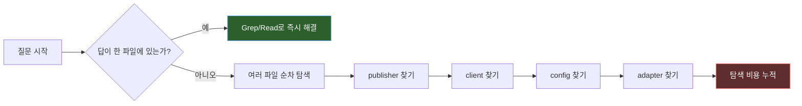
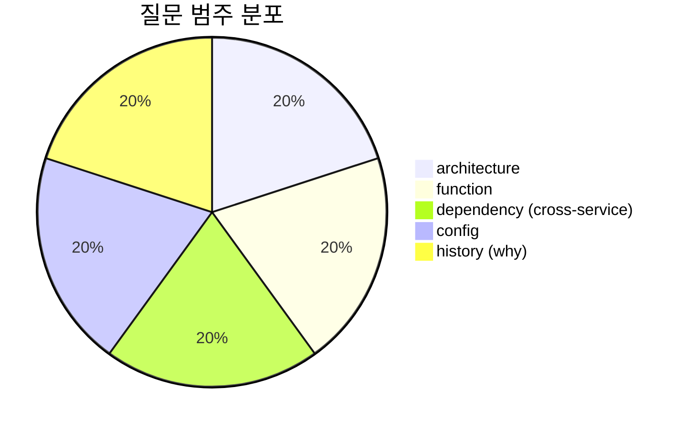
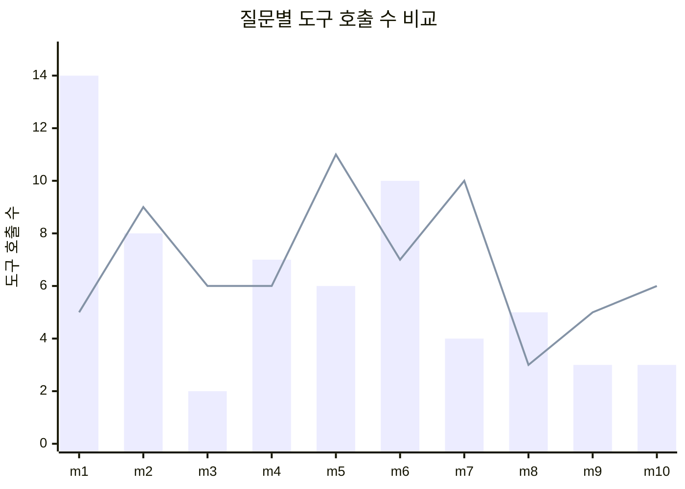
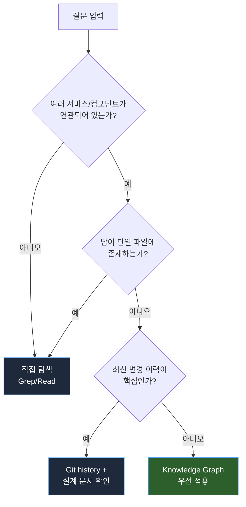

대규모 마이크로서비스 코드베이스를 다루다 보면, 답을 찾는 일보다 "어디서부터 찾아야 하는지"를 정하는 일이 더 오래 걸릴 때가 많습니다.

특히 LLM에게 코드를 읽히는 워크플로우에서는 이 문제가 더 선명하게 드러납니다. 함수 하나를 이해하는 일은 어렵지 않습니다. 하지만 다음과 같은 질문은 쉽게 느려집니다.

- 주문 승인 같은 end-to-end 흐름은 어느 서비스들을 거치는가
- 여러 서비스가 공유하는 인프라는 어디에 묶여 있는가
- 설정과 DI 구성이 여러 파일에 흩어져 있을 때 전체 구조는 어떻게 생겼는가

이런 질문은 보통 `grep`과 파일 열람을 반복하면서 답하게 됩니다. 답은 얻을 수 있지만, 탐색 비용이 높습니다. 그래서 코드 인덱싱 기반 Knowledge Graph를 붙이면 이 비용을 줄일 수 있을지 실험해 봤습니다.

## 핵심 요약

| 항목 | 내용 |
| --- | --- |
| **결론** | Knowledge Graph는 모든 질문을 빠르게 만들지 않습니다. 하지만 특정 질문 유형에서는 tool call을 30~60% 이상 줄여줍니다. |
| **핵심 인사이트** | 실전 ROI는 그래프 자체의 품질보다 **"어떤 질문을 그래프로 보낼지"를 정하는 라우팅 규칙**에서 나옵니다. |
| **확정 사항** | cross-service, architecture, distributed config 질문에 그래프 적용 시 유효 |
| **확인 필요** | 팀 내 질문 유형 분류 기준, 라우팅 규칙의 운영 일관성 |

## 문제 상황: 왜 기존 탐색은 특정 질문에서 느려질까

### 답이 한 파일에 있는 질문 — 직접 탐색이 빠름

- 특정 메서드 구현 상세를 묻는 질문
- 테스트 시나리오 목록처럼 한 파일 안에 답이 있는 질문
- 최신 변경 이유처럼 변경 이력이 더 중요한 질문

이 경우에는 파일 하나를 찾고 읽으면 끝납니다. 그래프를 거치는 순간 오히려 단계가 하나 늘어납니다.

### 답이 여러 파일에 흩어진 질문 — 구조적으로 느림

- 여러 서비스와 컴포넌트가 연결된 end-to-end 흐름
- cross-service shared infrastructure 식별
- 여러 Config 클래스에 흩어진 Bean 또는 설정 구조 파악

느린 이유는 단순합니다. 답이 한 파일에 없기 때문입니다. 탐색자는 여러 파일을 순차적으로 열고, 각 파일이 가리키는 다음 파일로 계속 이동해야 합니다. LLM도 똑같이 이 비용을 지불합니다.

## 실험 설계

두 가지 접근을 비교했습니다.

| 구분 | 직접 탐색 (Baseline) | Knowledge Graph 탐색 |
| --- | --- | --- |
| 허용 도구 | `grep`, `glob`, 파일 읽기 | 위 도구 + `graphify query / explain / path` |
| 워크플로우 | 코드를 직접 순차 탐색 | subgraph를 먼저 추출 → 필요한 부분만 코드 확인 |

평가 기준은 세 가지였습니다.

- **정확도**: 정답 품질이 유지되는가 (rubric 0~3점)
- **도구 호출 수**: 세션 내 총 도구 호출 횟수
- **입력 토큰**: 세션 전체 입력 토큰량

질문은 5개 범주로 나눴습니다.

## 실험 결과

### 전체 평균: 두 방식이 사실상 동등

| 지표 | 직접 탐색 (A) | 그래프 탐색 (B) | Δ 절대값 | Δ 상대값 |
| --- | --- | --- | --- | --- |
| 평균 도구 호출 수 | 6.2 | 6.8 | +0.6 | +9.7% |
| 평균 입력 토큰 | 36,598 | 37,426 | +828 | +2.3% |
| 평균 정확도 (0~3) | 3.00 | 3.00 | 0.00 | 동등 |
| 정확도 만점 비율 | 10/10 | 10/10 | — | 동등 |

**해석**: 두 그룹은 전체 평균 수준에서 사실상 동등합니다. 평균이 "동등"한 이유는 질문 유형마다 효율이 크게 다른데 이를 섞어서 평균을 냈기 때문입니다.

### 질문별 실측 데이터: 편차의 핵심

10개 질문 각각에 대해 두 방식의 도구 호출 수를 직접 비교했습니다.

| Q | 카테고리 | A (직접) | B (그래프) | Δ% | 우세 방식 |
| --- | --- | --- | --- | --- | --- |
| m1 | architecture | **14** | 5 | **-64.3%** | **B** |
| m2 | architecture | 8 | 9 | +12.5% | A |
| m3 | function | **2** | 6 | +200.0% | **A** |
| m4 | function | 7 | 6 | -14.3% | B |
| m5 | dependency | 6 | 11 | +83.3% | A |
| m6 | dependency | **10** | 7 | **-30.0%** | **B** |
| m7 | config | 4 | 10 | +150.0% | A |
| m8 | config | **5** | 3 | **-40.0%** | **B** |
| m9 | history | 3 | 5 | +66.7% | A |
| m10 | history | 3 | 6 | +100.0% | A |

**패턴 요약**:

| 관찰 | 근거 |
| --- | --- |
| 그래프 탐색이 유리했던 4문항은 절감 폭이 컸음 (-14% ~ -64%) | m1, m4, m6, m8: 평균 **-37.2%** 호출 절감 |
| 직접 탐색이 유리했던 6문항은 차이가 상대적으로 작았음 (절대값 기준 +1~+6 calls) | 단일 파일에 답이 있으면 Grep 한두 번이면 끝남 |
| 전체 평균에서 B가 +9.7%인 이유는 직접 탐색이 유리한 문항 수가 더 많았기 때문 | 절대 차이는 작음 (62 vs 68 calls over 10Q) |

### 카테고리별 집계

| 카테고리 | A calls 합 | B calls 합 | Δ% | A tokens 합 | B tokens 합 | Δ% | 대표 문항 |
| --- | --- | --- | --- | --- | --- | --- | --- |
| architecture | 22 | 14 | **-36.4%** | 105,688 | 79,959 | **-24.3%** | m1: end-to-end 흐름 (-64%) |
| function | 9 | 12 | +33.3% | 56,925 | 67,943 | +19.4% | m3: 특정 메서드 (A 3배 효율) |
| dependency | 16 | 18 | +12.5% | 72,891 | 77,585 | +6.4% | m6: shared infra (B -30%) |
| config | 9 | 13 | +44.4% | 67,779 | 67,283 | -0.7% | m8: 분산 설정 (B -40%) |
| history | 6 | 11 | +83.3% | 62,692 | 81,494 | +30.0% | 단일 파일 또는 주석으로 답이 나옴 |

**핵심 발견**: architecture 카테고리만 카테고리 수준에서도 그래프 탐색이 뚜렷하게 우세했습니다. 나머지 카테고리는 질문별 편차가 커서 평균만으로 일괄 판단하기 어려웠습니다.

### 그래프가 유효했던 질문 — 구체 사례

**사례 1: end-to-end 흐름 질문 (m1, -64%)**

질문: "특정 비즈니스 흐름이 end-to-end로 어떻게 동작하는가?"

| 경로 | 도구 호출 흐름 | 호출 수 | 결과 |
| --- | --- | --- | --- |
| A (직접) | EventPublisher → GrpcClient → Config → Adapter를 하나씩 찾아가며 파일 열람 | **14** | 정답 |
| B (그래프) | `graphify query` 한 번으로 BFS subgraph 추출 → 관련 노드·엣지 확인 → 검증 필요 코드만 추가 열람 | **5** | 정답 |

**사례 2: cross-service 공유 인프라 질문 (m6, -30%)**

질문: "여러 서비스가 공유하는 특정 인프라 컴포넌트를 나열하라"

| 경로 | 도구 호출 흐름 | 호출 수 | 결과 |
| --- | --- | --- | --- |
| A (직접) | Grep으로 여러 서비스에서 히트 → Read 각 파일 → 관련 클래스 추적 → 추가 조사 | **10** | 정답 (9개 컴포넌트 식별) |
| B (그래프) | `graphify query` → Cross-service community 라벨 확인 → 필요한 2개 파일만 Read | **7** | 정답 (9개 컴포넌트 식별 + 그룹화 정보 함께 제공) |

### 그래프가 비효율적이었던 질문

| 질문 유형 | 이유 |
| --- | --- |
| 특정 메서드 구현 상세 | 이미 답이 한 파일에 있어 subgraph 추출이 불필요한 오버헤드 |
| 단일 파일 내 열거형 목록 | 파일 하나를 읽으면 끝인데 graph query 호출이 단계만 추가 |
| "왜 바뀌었나" 변경 이력 질문 | 그래프는 구조를 보여줄 뿐, 변경 맥락은 담지 못함 |

## 의사결정: 질문 라우팅 규칙

> Knowledge Graph의 가치는 "항상 쓰면 빨라진다"가 아니라, **"특정 질문에만 선택적으로 쓸 때 이득이 커진다"**는 데 있습니다.

그래프를 도입하는 것 자체보다 먼저 해야 할 일은 **질문 라우팅 규칙**을 만드는 것입니다.

### 라우팅 의사결정표

| 라우팅 대상 | 진입 방식 | 근거 |
| --- | --- | --- |
| 여러 서비스를 가로지르는 흐름 질문 | `graphify query` 우선 | architecture 질문에서 최대 -64% 절감 확인 |
| 공유 인프라 식별 ("A, B, C가 공유하는 X는?") | `graphify query` 우선 | cross-service 커뮤니티 라벨이 즉시 관련 컴포넌트 묶어줌 |
| 여러 파일에 흩어진 설정/DI 구조 | `graphify query` 우선 | 분산된 Bean을 community 단위로 한 번에 제시 |
| 두 개념 사이 관계/경로 | `graphify path` 우선 | 최단 경로 조회로 바로 연결 구조 파악 |
| 특정 함수/메서드 내부 로직 | Grep/Read 직접 | 단일 파일에 답이 있어 graph query가 오버헤드 |
| 단일 파일 내 열거형 목록 | Grep/Read 직접 | 위와 동일 |
| 최신 변경 이력/설계 논의 | Git log + 문서 | 그래프는 최신 PR 이력 반영 못함 |

## 제한점 및 리스크

| # | 제한점 | 영향 | 대응 방안 | 확인 방법 |
| --- | --- | --- | --- | --- |
| 1 | 그래프는 최신 맥락을 항상 반영하지 못함 | "왜 바뀌었나" 질문에 한계 | 변경 이력과 설계 문서를 별도로 확인 | graph 결과와 git log 비교 |
| 2 | 범위를 너무 넓히면 community가 "잡탕"이 됨 | 전체 서비스 통합 그래프는 오히려 정보 분산 | 좁은 범위 그래프를 기본값으로 사용 | community별 노드 수 모니터링 |
| 3 | LLM은 긴 wiki보다 정제된 진입점에 더 적합 | wiki markdown 직접 열람 시 +14~84% 오버헤드 | `graphify query`로 subgraph만 소비 | wiki 직접 읽기 vs query 비교 측정 |

## 후속 액션

| # | 액션 | 완료 기준 | 우선순위 |
| --- | --- | --- | --- |
| 1 | 팀 내 빈출 질문 유형 분류 | 상위 20개 질문을 5개 범주로 분류 완료 | 높음 |
| 2 | 라우팅 규칙을 워크스페이스 지침에 반영 | `CLAUDE.md` 또는 `AGENTS.md`에 규칙 명시 | 높음 |
| 3 | 좁은 범위 그래프를 기본값으로 고정 | 타겟 서비스 단위 그래프를 주 탐색 도구로 사용 | 중간 |
| 4 | 추가 인원으로 재측정 | 2인 이상, 동일 질문셋 + 실무 질문 샘플로 검증 | 중간 |
| 5 | 그래프 자동 재빌드 파이프라인 구축 | CI weekly 재빌드로 최신성 유지 | 낮음 |

## 마무리

Knowledge Graph는 코드 탐색의 만능 해법이 아니었습니다. 하지만 그 점이 오히려 더 흥미로웠습니다. 정말 중요한 것은 "그래프를 썼는가"가 아니라 **"언제 써야 하는가"**였습니다.

LLM을 코드 탐색에 본격적으로 활용할수록, 검색 품질 못지않게 **질문을 올바른 탐색 경로로 라우팅하는 설계**가 중요해집니다. 이번 실험의 가장 큰 수확은 그래프 자체보다 그 운영 규칙이었습니다.

비슷한 실험을 하시려면, 그래프 구축부터 시작하지 않으셔도 됩니다. 먼저 팀의 질문 유형부터 정리해 보세요. 어떤 질문이 가장 자주 느린지 분류하는 순간, 그래프가 필요한 자리와 필요 없는 자리가 생각보다 빨리 드러납니다.
