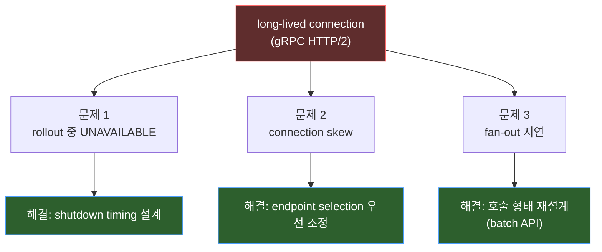
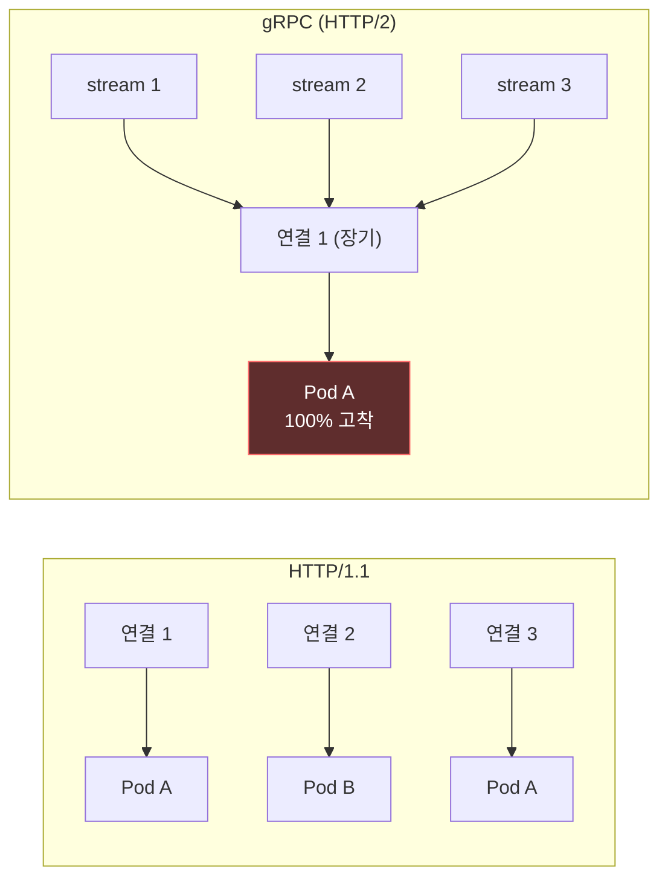
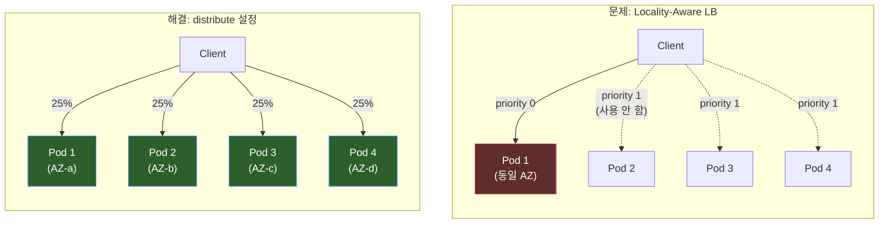
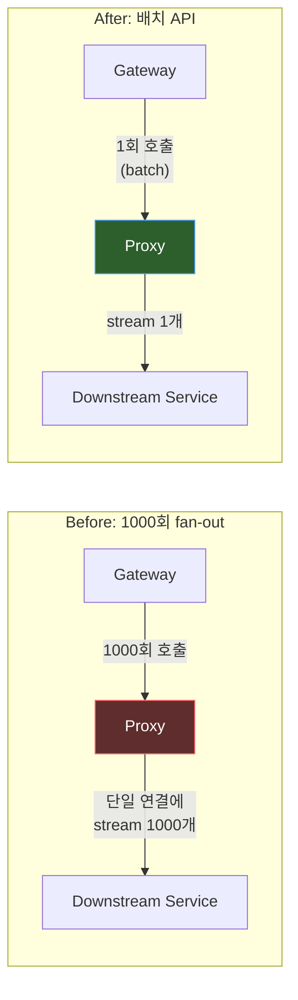
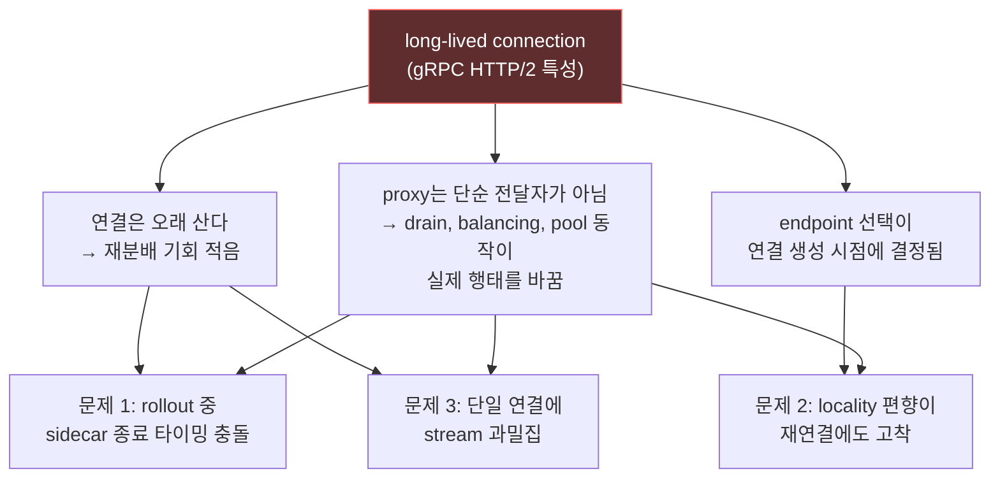

gRPC와 service mesh를 함께 쓰는 시스템을 운영하다 보면, 얼핏 서로 관계없어 보이는 문제들이 비슷한 시기에 튀어나올 때가 있습니다.

- rollout 중 간헐적인 `UNAVAILABLE` 에러
- 일부 Pod에만 트래픽이 몰리는 connection skew
- fan-out 요청에서 비정상적으로 높아지는 지연 시간

처음에는 각각 따로 해결해야 하는 문제처럼 보였습니다. 하나는 배포 문제, 하나는 load balancing 문제, 또 하나는 성능 문제였기 때문입니다.

그런데 실험을 진행할수록 세 문제를 하나로 묶는 공통 배경이 보이기 시작했습니다. 핵심은 **long-lived connection**이었습니다. gRPC의 HTTP/2 연결은 오래 살아 있고, service mesh는 그 연결 위에서 endpoint를 선택하고 유지합니다. 이 특성이 rollout, 분산, 성능에 연쇄적으로 영향을 줬습니다.

## 핵심 요약

| 항목 | 내용 |
| --- | --- |
| **공통 원인** | 세 문제 모두 **long-lived connection + service mesh의 endpoint 선택 방식**에서 비롯됨 |
| **확정 사항** | shutdown timing 설계, locality-aware distribution 조정, fan-out reduction이 유효했음 |
| **확인 필요** | 프로덕션 환경 동일 테스트, 재연결 시나리오 확대 검증 |

### 문제-원인-해결 한눈에 보기



## 배경: HTTP/1.1 vs gRPC (HTTP/2) 핵심 차이

| 특성 | HTTP/1.1 | gRPC (HTTP/2) |
| --- | --- | --- |
| 연결 방식 | 요청마다 새 연결 또는 짧은 keep-alive | 하나의 연결에 모든 요청을 멀티플렉싱 |
| 연결 수명 | 짧음 (수 초 ~ 수십 초) | 김 (수십 분 ~ 수 시간) |
| LB 재분배 기회 | 연결을 맺을 때마다 다른 Pod 선택 가능 | 연결 생성 시 한 번만 endpoint 결정 |
| 연결당 동시 요청 | 1 (또는 파이프라이닝) | 수백~수천 스트림 동시 가능 |



## 문제 1: rollout은 성공했는데, 요청은 흔들렸다

### 현상

애플리케이션은 graceful shutdown을 하도록 설정했는데도, rollout 시점에 gRPC `UNAVAILABLE`가 간헐적으로 발생했습니다. 애플리케이션 로그만 보면 종료가 천천히 진행되는 것처럼 보였지만, 실제 네트워크 경로에서는 더 빨리 무언가가 사라지고 있었습니다.

### 원인

이 문제를 이해하려면 애플리케이션만 보면 안 됩니다. service mesh sidecar까지 포함한 종료 순서를 같이 봐야 합니다.

- app보다 sidecar가 먼저 연결 정리를 끝내는 경우
- endpoint 제거가 전파되기 전에 종료 중인 Pod로 트래픽이 한 번 더 들어오는 경우
- 에러가 난 endpoint를 mesh가 바로 격리하지 못하는 경우

즉, 애플리케이션 하나의 graceful shutdown만으로는 충분하지 않았습니다. **Kubernetes lifecycle, service registry 반영 타이밍, sidecar drain, client retry**가 함께 맞물려야 했습니다.

### 실측: Fix 적용 전후 비교

#### Baseline (Fix 적용 전)

| 항목 | Test v1 (0.5초 간격) | Test v2 (0.2초 간격) |
| --- | --- | --- |
| 총 요청 | 233건 | 600건 |
| 성공 (HTTP 200) | 233건 (100%) | 600건 (100%) |
| 실패 | 0건 | 0건 |
| 느린 요청 (>1s) | 0건 | 1건 (1.41s) |
| UNAVAILABLE 로그 | 0건 | 0건 |

**분석**: gRPC client retry(maxAttempts=3)가 Envoy 레벨 에러를 마스킹하고 있었습니다. 1건의 느린 요청(1.41s)은 retry가 실제로 발생했음을 시사합니다 (정상 응답 ~0.03s 대비).

#### Fix 후 단일 서비스 배포

| 항목 | 결과 |
| --- | --- |
| 총 요청 | 400건 |
| 성공 (HTTP 200) | 400건 (100%) |
| 느린 요청 (>1s) | 1건 (1.29s) |
| UNAVAILABLE 로그 | 0건 |

#### Fix 전후 비교

| 메트릭 | Fix 전 | Fix 후 | 변화 |
| --- | --- | --- | --- |
| 성공률 | 100% | 100% | 동일 |
| 느린 요청 최대 응답시간 | 1.41s | 1.29s | -0.12s 개선 |

#### Multi-hop gRPC Chain 동시 배포 검증

**시나리오 A: 2개 서비스 동시 배포**

| 항목 | 단일 hop | Multi-hop |
| --- | --- | --- |
| 총 요청 | 500건 | 500건 |
| 성공 | **500건 (100%)** | **500건 (100%)** |
| 느린 요청 (>1s) | **0건** | **0건** |

**시나리오 B: Multi-hop chain 양쪽 동시 배포**

| 항목 | Multi-hop |
| --- | --- |
| 총 요청 | 47건 |
| 성공 | **47건 (100%)** |
| 느린 요청 (>1s) | 1건 (2.85s) |
| UNAVAILABLE 로그 | 0건 |

**분석**: Multi-hop chain의 양쪽 끝을 동시 재배포해도 에러 0건. 시나리오 A에서는 느린 요청도 0건으로, Fix 후 Envoy drain이 정상 작동하여 retry 자체가 불필요해졌습니다.

### 해결: 종료 타이밍 시간관계 설계

종료 관련 설정은 독립 값이 아니라 **시간 관계**로 봐야 합니다.

```mermaid
gantt
    title Pod 종료 시퀀스 (정상 설계)
    dateFormat X
    axisFormat %s초

    section Kubernetes
    SIGTERM 수신             :done,   k1, 0, 0
    terminationGracePeriod   :active, k2, 0, 180

    section Sidecar
    drain 시작               :done,   s1, 0, 0
    활성 연결 0 시 즉시 종료  :s2, 0, 30
    drain 대기 (최대 30s)     :active, s3, 0, 30

    section App
    preStop sleep            :done,   a1, 0, 20
    Spring graceful shutdown  :active, a2, 20, 100
    gRPC server shutdown      :active, a3, 20, 95
```



**핵심 부등식**:

```text
preStop(20s) < sidecar drain(30s) < app shutdown(80s) < terminationGracePeriod(180s)
```

| 설정 | 값 | 역할 | 어긋나면 |
| --- | --- | --- | --- |
| `preStop sleep` | **20s** | K8s Endpoints에서 제거될 시간 확보 | 짧으면 트래픽이 종료 중인 Pod으로 유입 |
| `terminationDrainDuration` | **30s** | Envoy sidecar가 기존 연결 정리 | preStop보다 짧으면 sidecar가 먼저 죽음 |
| `EXIT_ON_ZERO_ACTIVE_CONNECTIONS` | **true** | 활성 연결 없으면 즉시 종료 | false면 drain 시간을 항상 풀로 대기 |
| `SPRING_LIFECYCLE_TIMEOUT` | **80s** | Spring이 진행 중인 요청 완료 대기 | 짧으면 처리 중인 요청 강제 중단 |
| `terminationGracePeriodSeconds` | **180s** | K8s 강제 종료 안전망 | 짧으면 graceful shutdown 전에 SIGKILL |

### 영향 범위

| 영역 | 영향 | 비고 |
| --- | --- | --- |
| 배포 프로세스 | rollout 중 에러 제거 | sidecar drain 연장 + outlier detection |
| 애플리케이션 | preStop, shutdown timeout 조정 필요 | Spring lifecycle, gRPC shutdown period |
| 운영 | probe 설정 재점검 필요 | startup/readiness/liveness 분리 설계 |
| QA | 재배포 시나리오 테스트 필요 | 단일/다중 서비스 동시 배포 검증 |

## 문제 2: 연결을 끊어도 트래픽이 다시 같은 Pod로 갔다

### 현상

요청 분포를 보니 일부 상황에서 트래픽이 특정 Pod에 거의 고정되었습니다.

### 초기 시도와 한계

처음에는 gRPC의 장기 연결 특성 때문이라고 생각했습니다. 그래서 가장 먼저 시도한 것은 **연결 rotation**이었습니다.

#### 실험 1: Baseline (설정 없음, 2-Pod)

| 시나리오 | Total CV | 판정 | 비고 |
| --- | --- | --- | --- |
| Steady-state (부하만) | 0.02 | BALANCED | 2-Pod에서는 LEAST_REQUEST가 양쪽에 균등 분배 |
| Scale-out (2→4) | 1.09 | SKEWED | 기존 연결이 유지되는 동안 신규 Pod로 트래픽이 가지 않음 |
| Rolling Restart | **1.00** | **SKEWED** | 새 연결이 단일 Pod에만 맺어짐 → 100% 고착 |
| 반복 Restart (x2) | 0.73 | SKEWED | 여전히 편중 |

```mermaid
gantt
    title Rolling Restart 시계열 (Baseline, 2-Pod)
    dateFormat X
    axisFormat %s초

    section Pod-1 (기존)
    트래픽 100% 유지     :done, p1, 0, 60
    종료                  :milestone, p1e, 60, 60

    section Pod-2 (신규)
    대기                  :active, p2, 0, 60
    트래픽 100% 이동      :done, p2a, 60, 120
```



#### 실험 2: maxRequestsPerConnection=1000

1000회 요청 후 연결을 재생성하여 장기 분산 개선을 시도했습니다.

| 시나리오 | 지표 | Exp 1 (무제한) | Exp 2 (1000) | 변화 |
| --- | --- | --- | --- | --- |
| Rolling restart | Total CV | 1.00 | **0.25** | 대폭 개선 |
| 반복 restart | Total CV | 0.73 | **0.001** | 극적 개선 |
| Rolling restart | Time-series CV | 1.53 | 1.77 | 악화 |

**시계열 (1000, Rolling restart)**:

```text
시간    Pod1    Pod2    Pod3    Pod4    Pod5
+56s    27      25       0       0       0   ← 기존 Pod
+91s     0       0      50       0       0   ← restart 후 → Pod A
+170s    0       0       0       0      52   ← 1000req rotation → Pod B
+260s    0      52       0       0       0   ← rotation → 다른 Pod
```

**해석**: 장기적 분산은 개선되었으나, 각 시점에서는 여전히 단일 Pod에 집중합니다.

#### 실험 3: maxRequestsPerConnection=50 (2-Pod)

50회 요청(~10초)마다 rotation하여 순간 분산도 개선을 시도했습니다.

| 지표 | Exp 1 (무제한) | Exp 2 (1000) | Exp 3 (50) |
| --- | --- | --- | --- |
| Total CV | 1.00 | 0.25 | **0.10** |
| Time-series CV | 1.53 | 1.77 | **1.02** |
| cx_total/endpoint | 1 | 1~2 | **8~9** |
| 에러 | 0 | 0 | 0 |

**시계열 (50, Rolling restart)**:

```text
시간    Pod1(기존) Pod2(기존) Pod3(신규) Pod4(신규)
+11s      24        24         0         0   ← 기존 2개에 균등
+45s      31        18         0         0   ← rotation마다 전환
+113s      0        29         0        21   ← 과도기: 기존1 + 신규1
+158s      0         0        30        19   ← 신규 2개에 즉시 균등
+294s      0         0        23        28   ← 끝까지 균등 유지
```

**해석**: 2-Pod에서는 rotation 빈도 증가로 분산이 개선됩니다.

#### 실험 4: 전환점 — 4-Pod에서 가설 기각

| 시도 | 방법 | Pod 수 | CV | 판정 |
| --- | --- | --- | --- | --- |
| maxRequestsPerConn=50 | 50회마다 rotation | 4 | **0.92** | **SKEWED** |

**4-Pod 실측 데이터**:

| Endpoint | Zone | rq_total | cx_total | 비율 |
| --- | --- | --- | --- | --- |
| Pod-1 | AZ-b | **1,348** | 27 | **100%** |
| Pod-2 | AZ-d | 0 | 0 | 0% |
| Pod-3 | AZ-a | 0 | 0 | 0% |
| Pod-4 | AZ-c | 0 | 0 | 0% |

**27번 연결을 끊고 다시 맺었지만, 매번 동일한 Pod를 선택했습니다.**

### 근본 원인: Locality-Aware Load Balancing



**문제는 연결이 오래 살아서만이 아니라, 재연결할 때도 같은 locality 집합으로 돌아간다는 점**이었습니다. 연결을 끊는 것 자체는 재분배를 보장하지 않습니다.

### 해결: endpoint selection을 먼저 조정

적용 순서가 중요합니다. 순서를 바꾸면 안 됩니다.

1. **endpoint selection 정책 확인** — locality/priority 편향 확인
2. **locality-aware distribution 명시적 조정** — cross-zone 균등 분배
3. **connection rotation은 보조 수단** — 위 두 단계가 맞을 때만 의미 있음

| 검증 | 설정 | Pod 수 | CV | 판정 |
| --- | --- | --- | --- | --- |
| distribute 적용 | 4개 AZ 균등 25% | 4 | **0.002** | **BALANCED** |
| 최종 검증 | 동일 설정 | 8 | 0.071 | BALANCED |

### 영향 범위

| 영역 | 영향 | 비고 |
| --- | --- | --- |
| 네트워크 트래픽 분산 | skew 대폭 개선 | CV 0.92 → 0.002 |
| DestinationRule 설정 | localityLbSetting.distribute 추가 필요 | 기존 설정에 영향 없음 |
| 운영 | Envoy /clusters 메트릭 모니터링 필요 | rq_total 분포 정기 확인 |

## 문제 3: 오류는 없는데도 fan-out 요청이 느렸다

### 현상

특정 API는 내부적으로 downstream gRPC를 매우 많이 fan-out하고 있었습니다. 기능적으로는 정상이고 오류도 없었지만, 지연 시간이 예상보다 높았습니다.

### 원인

장기 연결 하나 위에 많은 stream이 몰리면 **packet density**가 높아지고, service mesh proxy의 event loop가 그 부하를 직렬화된 형태로 받는 순간이 생깁니다.



### 해결: 호출 형태 재설계

#### 실측 요약

| 비교 항목 | 변경 전 | 변경 후 | 변화 |
| --- | --- | --- | --- |
| 요청 형태 | downstream fan-out 1000회 | batch API 1회 | 구조 단순화 |
| end-to-end latency | 기준값 100 | 16 | **-84%** |
| 병목 위치 | proxy event loop, packet density | 단일 batch 호출 중심 | 병목 축소 |

| 접근 | 방법 | 효과 |
| --- | --- | --- |
| pool tuning | 연결 수, concurrent stream 조정 | 한계 있음 |
| **batch API 전환** | 1000회 호출 → 1회 batch 호출 | **end-to-end latency -84%** |

fan-out 자체가 과하면, 가장 큰 이득은 **더 많은 튜닝이 아니라 호출 수를 줄이는 방향**에서 나옵니다.

### 영향 범위

| 영역 | 영향 | 비고 |
| --- | --- | --- |
| API 설계 | fan-out 호출을 batch API로 재설계 필요 | 기존 API 유지 가능 (점진 전환) |
| 성능 | latency 대폭 개선 | -84% 확인 |
| downstream 서비스 | batch endpoint 추가 필요 | 기존 단건 API는 영향 없음 |
| QA | batch API 정합성 테스트 필요 | 기존 단건 호출 결과와 동일 확인 |

## 공통 원인: 세 문제를 하나로 묶는 관점



| 공통 특성 | 문제 1에 미친 영향 | 문제 2에 미친 영향 | 문제 3에 미친 영향 |
| --- | --- | --- | --- |
| 연결이 오래 삶 | sidecar가 먼저 죽어도 연결이 남아 에러 | 장기 연결이 locality 편중을 고착화 | 단일 연결에 stream이 과밀집 |
| endpoint 선택 시점 | drain 후 재연결 시점이 중요 | 최초 선택된 locality에서 벗어나지 못함 | 해당 없음 |
| proxy의 능동적 역할 | drain, outlier detection이 종료 행태 결정 | locality-aware balancing이 분포 결정 | event loop 직렬화가 병목 |

## 운영 체크리스트

### Rollout

- [ ] app graceful shutdown만 보고 있지 않은가 — sidecar drain 시간도 함께 설계했는가
- [ ] sidecar drain 시간이 preStop보다 충분히 긴가
- [ ] readiness 제거와 endpoint 전파 시간을 고려했는가
- [ ] retry가 문제를 숨기고만 있지는 않은가 — retry 없이도 에러가 0인가

### Load Distribution

- [ ] skew가 connection lifetime 문제인지, selection policy 문제인지 분리했는가
- [ ] locality-aware policy가 특정 집합에 과도한 우선순위를 주고 있지 않은가
- [ ] reconnect가 실제 분산으로 이어지는지 메트릭으로 확인했는가

### Performance

- [ ] high fan-out 요청이 proxy에서 density 문제를 만들고 있지 않은가
- [ ] connection pool 튜닝 전에 호출 수 자체를 줄일 수 있는가
- [ ] batch API로 바꾸면 병목을 더 크게 줄일 수 있지 않은가

## 리스크 및 예외 케이스

| # | 리스크 | 영향 | 대응 방안 | 확인 방법 |
| --- | --- | --- | --- | --- |
| 1 | 프로덕션에서 다른 네트워크 topology로 재현 가능 | 프로덕션 적용 전 검증 필요 | 프로덕션과 동일한 zone/Pod 구성에서 재테스트 | 프로덕션 Canary 배포 후 메트릭 비교 |
| 2 | Spring/gRPC 버전에 따른 graceful shutdown 동작 차이 | shutdown timeout 설정이 다르게 동작할 가능성 | 주요 버전별 shutdown 동작 단위 테스트 | 버전 업그레이드 시 회귀 테스트 |
| 3 | batch API 전환 시 downstream 서비스 부하 패턴 변화 | 순간 부하가 집중될 가능성 | batch 크기 제한, rate limiting 적용 | 부하 테스트로 p99 latency 확인 |

## 후속 액션

| # | 액션 | 담당자 | 완료 기준 | 우선순위 |
| --- | --- | --- | --- | --- |
| 1 | 프로덕션 환경 동일 테스트 수행 | 미정 | rollout/skew/fan-out 3개 시나리오 프로덕션 검증 완료 | 높음 |
| 2 | QA 환경 반복 테스트 | 미정 | multi-hop chain 동시 배포 시나리오 통과 | 높음 |
| 3 | 종료 타이밍 설정값 문서화 | 미정 | 모든 서비스의 timeout/drain/probe 설정 단일 문서 정리 | 중간 |
| 4 | Envoy 메트릭 대시보드 구축 | 미정 | rq_total, cx_active, CV 값을 Grafana에서 실시간 확인 | 중간 |
| 5 | batch API 확대 적용 | 미정 | fan-out 패턴 조사 후 우선순위별 batch 전환 | 낮음 |

## 마무리

운영 문제는 자주 증상 단위로 들어옵니다. 배포 에러, skew, 성능 저하처럼 각각 다른 이름으로 올라옵니다. 하지만 그 밑바닥을 따라가 보면, 같은 구조적 특성이 여러 형태로 나타난 경우가 있습니다.

gRPC + service mesh 환경에서 공통점은 **long-lived connection**이었습니다.

이 관점을 얻고 나니 해결 순서도 달라졌습니다. rollout은 종료 타이밍의 문제로, skew는 endpoint selection의 문제로, fan-out 지연은 호출 구조의 문제로 다시 분리해서 볼 수 있었습니다. 그리고 각각의 설정값보다 먼저, 시스템이 연결을 **어떻게 만들고 얼마나 오래 유지하며 어디로 보내는지**를 이해하는 쪽이 훨씬 중요하다는 점을 배웠습니다.

비슷한 현상을 겪고 계시다면, 문제를 세 개로 나누기 전에 먼저 하나의 질문을 던져 보세요.

> **이 시스템의 long-lived connection은 지금 어디에서, 어떤 방식으로, 얼마나 오래 영향을 미치고 있는가?**

대개 해답의 절반은 그 질문 안에 들어 있습니다.
